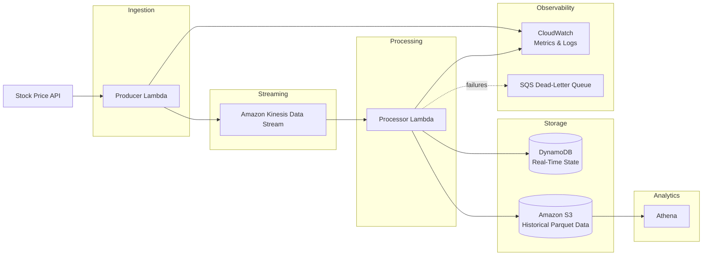

# Real-Time Stock Market Data Analytics Pipeline

## Project Overview

This project implements a **production-grade, real-time stock market data analytics pipeline** on AWS. It ingests streaming stock price data, processes it in near real time, stores low-latency state for operational queries, and persists historical data for large-scale analytics.

The system is designed to demonstrate modern **cloud-native data engineering practices**, including event-driven architecture, serverless compute, infrastructure as code, observability, and fault tolerance.

---

## Architecture Overview

### Architecture Diagram (Logical Flow)

```text
+--------------------+
|  Stock Price API   |
| (Public / Mocked)  |
+---------+----------+
          |
          v
+----------------------------+
| Producer Lambda (Python)   |
| - Fetches prices           |
| - Formats JSON events      |
+-------------+--------------+
              |
              v
+----------------------------+
| Amazon Kinesis Data Stream |
|        (stock-stream)      |
+-------------+--------------+
              |
              v
+-------------------------------+
| Processor Lambda (Python)     |
| - Decode records              |
| - Calculate moving averages  |
| - Structured logging          |
+-----------+-----------+-------+
            |           |
            v           v
+----------------+   +---------------------------+
| DynamoDB       |   | Amazon S3                 |
| (Real-time     |   | (Historical Parquet Data) |
|  latest state) |   | year/month/day partitions |
+----------------+   +-------------+-------------+
                                      |
                                      v
                            +--------------------+
                            | Amazon Athena      |
                            | (SQL Analytics)    |
                            +--------------------+

Observability & Reliability:
- CloudWatch Metrics & Logs
- CloudWatch Alarms
- SQS Dead-Letter Queue (DLQ)
```

**High-level flow:**

1. A producer Lambda fetches real-time stock prices from a public API and publishes events to **Amazon Kinesis Data Streams**.
2. A Kinesis-triggered processor Lambda consumes records, enriches and aggregates the data (including a moving average), and:

   * Writes the latest state to **Amazon DynamoDB** for low-latency access
   * Stores raw historical events in **Amazon S3** partitioned by date
3. **Amazon Athena** queries historical data directly from S3 using SQL.
4. **CloudWatch metrics, alarms, logs, and DLQs** provide observability and reliability.

This architecture supports both **real-time operational queries** and **cost-efficient analytical workloads**.

---

## Mermaid Architecture Diagram (GitHub Rendered)

The following Mermaid diagram renders natively on GitHub and is optimized for **system design interviews**, clearly showing data flow, scaling boundaries, and failure handling.



---

## How to Explain This Diagram in a System Design Interview

**1. Ingestion Layer**
A serverless Lambda fetches external stock prices and publishes events to Kinesis, decoupling producers from consumers.

**2. Streaming Layer**
Kinesis provides durable, scalable, ordered ingestion with shard-based parallelism and at-least-once delivery.

**3. Processing Layer**
A Lambda consumer processes events in batches, performs lightweight aggregation, and fans out writes to multiple storage systems.

**4. Storage Strategy**

* **DynamoDB** handles low-latency, real-time queries for the latest stock state
* **S3** stores immutable historical data optimized for analytics

**5. Analytics Layer**
Athena enables serverless SQL analytics directly on S3 without data duplication.

**6. Observability & Reliability**
CloudWatch provides metrics, structured logs, and alarms, while an SQS DLQ ensures failed records are never lost.

---

## Tech Stack

**AWS Services**

* Amazon Kinesis Data Streams – real-time ingestion
* AWS Lambda (Python 3.11) – serverless processing
* Amazon DynamoDB – low-latency state storage
* Amazon S3 – durable historical storage
* Amazon Athena – serverless analytics
* Amazon CloudWatch – metrics, logs, alarms
* Amazon SQS – dead-letter queues
* AWS Secrets Manager – secure API key storage

**Infrastructure & Tooling**

* Terraform – infrastructure as code
* Parquet – columnar storage format
* GitHub – version control

---

## Repository Structure

```text
.
├── terraform/
│   ├── modules/
│   │   ├── kinesis/
│   │   ├── lambda/
│   │   ├── dynamodb/
│   │   ├── s3/
│   │   ├── dlq/
│   │   └── secrets/
│   ├── main.tf
│   ├── variables.tf
│   ├── outputs.tf
│   └── terraform.tfvars
│
├── lambdas/
│   ├── producer/
│   │   ├── app.py
│   │   └── requirements.txt
│   └── processor/
│       ├── app.py
│       └── requirements.txt
│
├── athena/
│   └── stock_market_table.sql
│
└── README.md
```

---

## Setup Instructions

### Prerequisites

* AWS account
* Terraform >= 1.5
* AWS CLI configured
* Python 3.11

### 1. Configure Variables

Edit `terraform.tfvars`:

```hcl
project_name      = "stock-pipeline"
environment       = "dev"
aws_region        = "us-east-1"
dynamodb_table    = "stock-realtime"
s3_bucket         = "stock-historical-data-dev"
```

### 2. Deploy Infrastructure

```bash
cd terraform
terraform init
terraform apply
```

### 3. Deploy Lambda Code

Package and deploy Lambda functions (or use CI/CD):

```bash
zip -r producer.zip app.py requirements.txt
zip -r processor.zip app.py requirements.txt
```

### 4. Create Athena Table

Run the SQL file in the Athena console:

```sql
athena/stock_market_table.sql
```

---

## Example Athena Queries

### Average Price Per Stock (Daily)

```sql
SELECT symbol, AVG(price) AS avg_price
FROM stock_market_data
WHERE year = 2026 AND month = 1 AND day = 18
GROUP BY symbol;
```

### Intraday Price Trend

```sql
SELECT event_time, price
FROM stock_market_data
WHERE symbol = 'AAPL'
  AND year = 2026 AND month = 1 AND day = 18
ORDER BY event_time;
```

### Top Traded Stocks by Volume

```sql
SELECT symbol, SUM(volume) AS total_volume
FROM stock_market_data
WHERE year = 2026
GROUP BY symbol
ORDER BY total_volume DESC
LIMIT 5;
```

---

## Observability & Reliability

* **Custom CloudWatch metrics** (latency, failures)
* **Structured JSON logs** for fast querying
* **Dead-letter queues (SQS)** to prevent data loss
* **Idempotent DynamoDB writes** to handle retries safely
* **Partial batch failure handling** for Kinesis events

These features ensure the system is safe to operate under real-world failure conditions.

---

## What This Project Demonstrates

* Event-driven, serverless data architecture
* Real-time stream processing with Kinesis
* Low-latency vs analytical data modeling
* Infrastructure as code with Terraform
* Production-grade observability and fault tolerance
* Cost-efficient analytics using S3 + Athena

This project reflects patterns used in **financial data platforms, telemetry pipelines, and real-time analytics systems**.

---

## Future Improvements

* Add CI/CD with GitHub Actions
* Introduce Glue Data Catalog automation
* Implement Athena Iceberg tables
* Add replay Lambda for DLQ records
* Build a dashboard (QuickSight / Grafana)
* Add schema validation with Glue Schema Registry

---

## Summary

This project showcases the design and implementation of a **scalable, reliable, and observable real-time data pipeline** using AWS managed services, following modern data engineering best practices.
